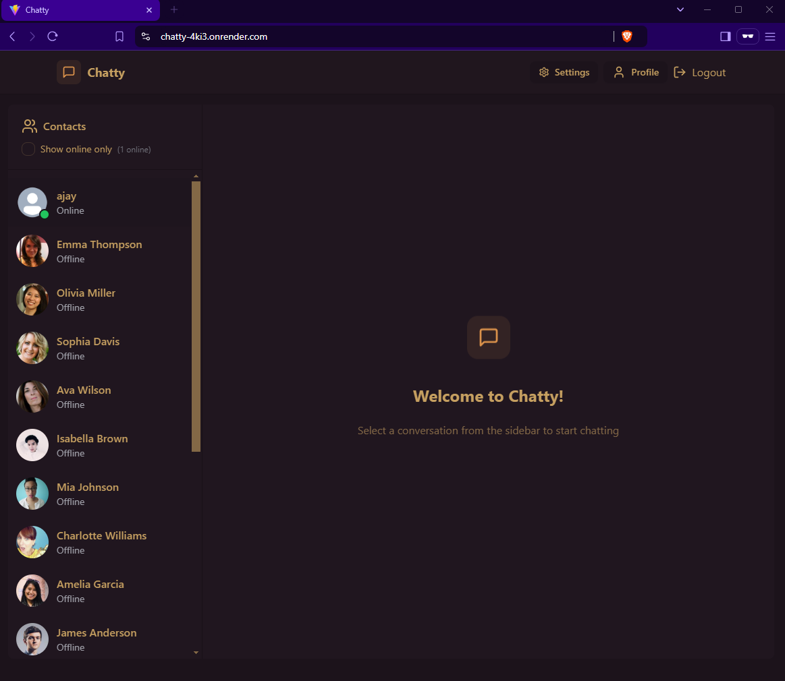

# Chatty - Real-Time Messaging Application 🗨️

A full-stack real-time chat application built with React.js, Node.js, MongoDB, and WebSocket technologies. This project demonstrates user authentication, real-time messaging, and a responsive UI for desktop and mobile platforms.
---

## Features

- **User Authentication:** Secure sign-up and login functionality using JWT.
- **Real-Time Messaging:** Send and receive messages instantly with WebSocket integration.
- **Profile Management:** Update user profiles with profile pictures.
- **Theming:** Choose from 32 different themes for a personalized user experience.
- **Responsive Design:** Works seamlessly across all screen sizes.
- **Error Handling:** Informative error messages for better UX.
- **Notifications:** Real-time toast notifications for important updates.
- **Secure:** Implemented best practices for authentication and data security.

---

## Technologies Used

### Frontend
- React.js
- Tailwind CSS
- DaisyUI
- React Router

### Backend
- Node.js
- Express.js
- MongoDB
- JWT for authentication
- WebSocket for real-time communication

---

## Screenshots 📸

### Login Page
  
*Secure and user-friendly login page.*

### Chat Interface
  
 
*Real-time chat interface with smooth messaging functionality.*

### Profile Page
  
*Manage your profile and update your details.*

### Setting Page
  

---

## Installation & Setup 🚀

### Prerequisites
- Node.js installed on your machine.
- Supabase account for backend setup.

### Backend Setup
1. Clone the repository:
   ```bash
   git clone https://github.com/ajay-9/chatty.git
   ```
2. Install dependencies
   ```bash
   cd backend
   npm install
3. Add .env files:
   ```bash
   MONGODB_URI=
   PORT =5001
   JWT_SECRET =seckey
   CLOUDINARY_CLOUD_NAME =
   CLOUDINARY_API_KEY =
   CLOUDINARY_API_SECRET =
   NODE_ENV =

4. Starting
   a. Start the backend server:
   ```bash
   cd backend
   npm run dev
   ```
   b. Start the frontend development server:
    ```bash
   cd frontend
   npm run dev
   ```
